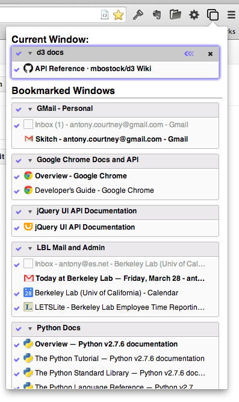
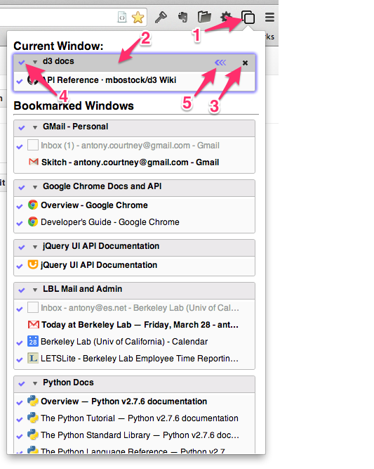

# Subjective Tab Manager

*Antony Courtney*

## Overview

Google Chrome is an excellent web browser but has limited features for managing windows and tabs. Specifically:

  * The top-level **Window** menu displays only the title text of the current active tab for a window. This is often not sufficient to identify a particular target window.  For example, users often have a window dedicated to their web-based mail client (such as GMail).  But clicking on a link in a GMail message will open the link in a new tab, resulting in an entry in the **Window** menu that makes no mention of GMail.

  * As the number of tabs open in a window increases, the title text on each tab header is truncated to the point of illegibility. This makes it difficult to find a specific tab of desired content or to efficiently close unwanted tabs.

  * While Chrome supports rudimentary features for saving and organizing URLs as bookmarks, there is no direct connection between saved bookmarks and open windows and tabs.  This makes it difficult to use Chrome to efficiently browse the ever-increasing volume of reference documentation available on the web.

The Subjective Tab Manager is my attempt to improve window and tab management in Chrome.  Subjective Tab Manager is a Chrome Extension that adds a *browser action* with a popup window to Chrome:

The popup can be used to quickly scroll through all open windows and tabs and switch to or close any open window or tab with a single click.  The Subjective Tab Manager also supports saving and restoring sets of tabs ( "Bookmarked Windows" ).

## Installation

To install the alpha release of Subjective Tab Manager do the following:

1. Download the packed extension file **tabman.crx** and save it to your computer.  ( *Subjective Tab Manager is currently in limited alpha release. Please email me directly if you are interested in being an alpha tester and I'll send you a download link.* )

2. Click the Chrome menu icon (the "Cheeseburger" icon with 3 horizontal lines) on the browser toolbar.

3. Select **Tools > Extensions**.

4. Locate the .crx file saved to your computer in Step 1 and drag the file onto the Extensions page.

5. Click **Install** to proceed.

See [Chrome's Third Party Extension Install Page](https://support.google.com/chrome_webstore/answer/2664769?p=crx_warning&rd=1) if you want more detail on the process.

## Usage

Here is a quick summary of the main components in the Subjective Tab Manager interface:

1. Clicking on the Subjective Tab Manager icon in the toolbar will open the popup window.  The popup window shows a scrollable list of summary information for all open windows and all "Bookmarked Windows" (whether open or not).

2. Clicking on the header bar for any window will make that window the active window.  Within a window summary, clicking on the title of any tab will switch to the containing window and make the selected tab the active tab.    

3. Clicking on the close icon in the upper right of a window header will close that window and all its tabs. A close icon will also appear when rolling over individual tabs within a window summary.  Clicking the close icon for an individual tab will close that tab.

4. Clicking the checkbox in the upper left corner of a window summary of a window that hasn't yet been bookmarked will *bookmark* that window and all its tabs. Bookmarking a window saves all of the currently open tabs in that window to a folder that you name using Chrome's existing bookmarks facility, and associates that folder with the window. This makes it easy to restore a bookmarked window and all of its tabs in a later browsing session, or to revert a bookmarked window back to its original state.
The blue check mark next to an individual tab within a window summary indicates whether or not the particular tab is bookmarked.  Clicking the checkbox next to a tab will add or remove a bookmark for that tab.
If a window has been bookmarked, clicking on the bookmark checkbox for the window will remove the bookmark folder for the window and all its tabs.

5. Clicking the "Revert" button on a bookmarked window will discard the current state of a window and revert back to the set of explicitly bookmarked tabs. This is useful when bookmarked windows are used for organizing reference documentation and the window state drifts substantially over a browsing session.

### Getting Started and Best Practice

How you organize and bookmark your windows is obviously...well...subjective.  But the way I use the extension for reference documentation is this: I typically open a window per topic ( Such as "d3" or "Python" or "HTML5 and CSS" ), open the main high-level entry pages related to the topic in a few tabs in that window, and then bookmark the window in that state.  See the "Python Docs" Bookmarked window in the screenshot above for an example.  

## Known Issues / Planned Extensions

Subjective Tab Manager is still very much a work-in-progress.  Some of the features I am considering before a first official release:

### Planned Features

* Search - There should be an incremental search facility at the top of the popup for finding windows by typing instead of visually scanning.

* Context Menu - There should be a context menu item for opening a link in a specific existing window.

* URL Pattern Matching - I would like to be able to associate URL patterns with a bookmarked window so that, for example, all *.facebook.com URLs will open in a bookmarked "Facebook" window.

* Duplicate Detection - Subjective Tab Manager should keep track of all the URLs currently open. If the user opens an URL that is already open, it should offer to switch to that tab instead of opening a new one.

* Revert at tab level - While Revert of a whole window is useful, it may also be useful to track an individual bookmarked tab, and offer an interface to revert just that one tab back to its original bookmark.

* Locked tabs - The default behavior when clicking on a link on a web page is to replace the current page with the contents of the link.  For the top-level Table of Contents type pages for a reference manual, this is often not the ideal behavior. It would be useful to be able to specify a bookmarked tab as "locked" so that all links opened from that tab will open in a new tab.

### Known Issues

* There should be more feedback and perhaps a confirmation dialog before unchecking the "Bookmark" checkbox for a window. If you do this by mistake, fear not: The folder of bookmarks for Un-bookmarked windows are moved to an _Archive folder that you can find with Chrome's Bookmark Manager if you need to recover it.

### Related Work

Subjective Tab Manager was inspired by a similar Chrome Extension called [Project Tab Manager](https://chrome.google.com/webstore/detail/project-tab-manager/iapdnheekciiecjijobcglkcgeckpoia?hl=en), and the design grew out of my experiences using that extension.  The main differences are that Subjective Tab Manager provides features for browsing and managing all open windows and tabs ( not just bookmarked ones ), and offers facilities for identifying how a bookmarked window has drifted from its original state and efficiently reverting to that original state.

## Feedback

I welcome candid feedback, suggestions and bug reports, especially during this "Friends Only" alpha release.  Please let me know your experience with Subjective Tab Manager, for better or for worse!

Email me at *firstname.lastname*@gmail.com.